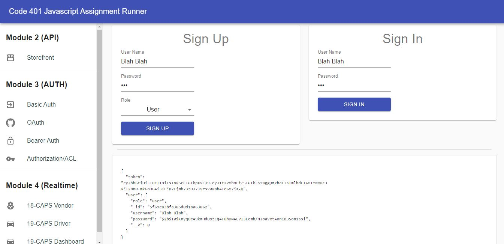
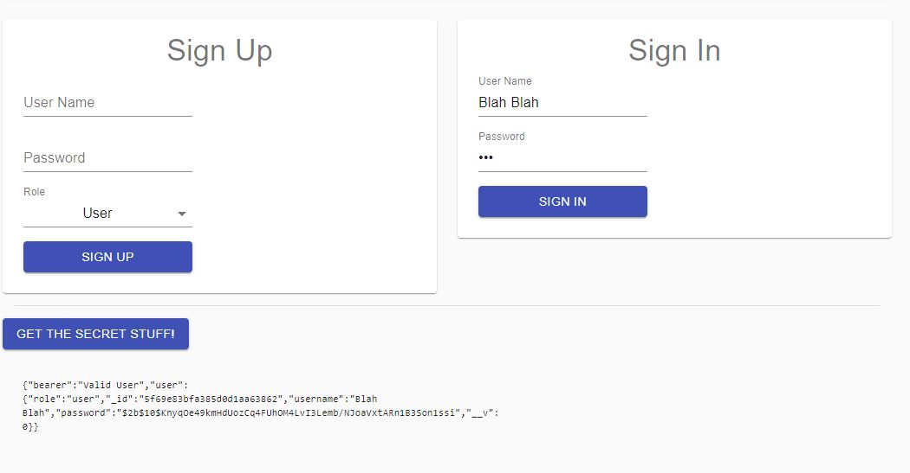
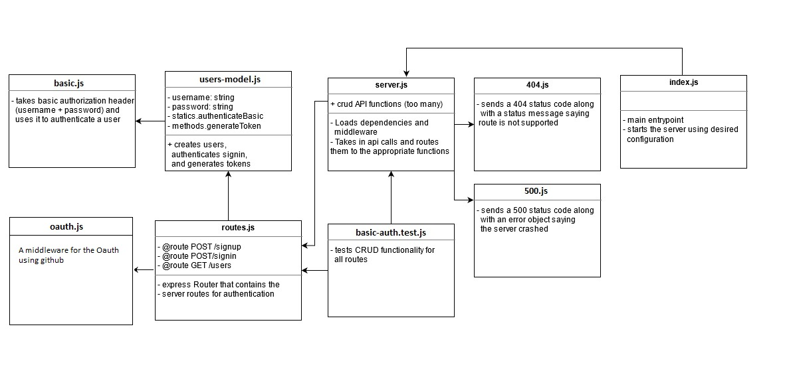

# Auth-server

An Express/Node.js based server using a custom “authentication” module that is designed to handle user registration and sign in using Basic, Bearer, or OAuth along with a custom “authorization” module that will grant/deny users access to the server based on their role or permissions level.

## Prerequisites:

for an Express server that implements Basic Authentication, with signup and signin capabilities, using a Mongo database for storage, we need :

1. `npm install`
2. mongoDb installed locally.
3. a software to deal with server routes
4. `npm start`
5. open the browser on localhost

## Technologies

- Express
- Express Router
- dotenv
- MongoDB (Mongoose)
- Jest & supergoose
- Cors and Morgan
- Bcrypt & JWT
- base64
- superagent

### For testing : 

- `npm test`

### .env requirements (where applicable):

- PORT = 3000
- MONGOOSE_URI = mongodb://localhost:27017/users
- SECRET = ash
- CLIENT_ID = YOUR_CLIENT_ID
- CLIENT_SECRET = YOUR_CLIENT_SECRET
- API_SERVER = http://localhost:3000/oauth
- TOKEN_SERVER = https://github.com/login/oauth/access_token
- REMOTE_API = https://api.github.com/user

## Visual Validation
Using this [online test](https://javascript-401.netlify.app/) you can see the following results:

For secret routes:

## UML

